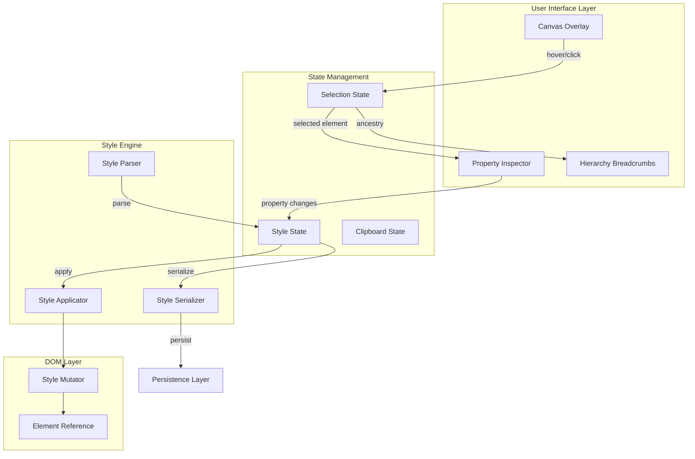

# Visual Design Studio - Design Document

## Overview

The Visual Design Studio is a browser-based no-code/low-code interface that enables users to visually customize web elements on a rendered canvas. The system consists of three main components: a Canvas Overlay for element selection and highlighting, a Property Inspector Panel for editing element properties, and a Style Engine that applies changes in real-time.

The architecture follows a unidirectional data flow pattern where user interactions trigger state changes, which are then reflected both in the Property Inspector UI and the canvas rendering.

## Architecture



### Data Flow

1. User hovers/clicks on canvas → Selection State updates
2. Selection State triggers Property Inspector render with element data
3. User modifies property in Inspector → Style State updates
4. Style Engine applies changes to DOM element
5. Style Serializer persists changes for save/restore

## Components and Interfaces

### CanvasOverlay

Handles element highlighting and selection on the canvas.

```typescript
interface CanvasOverlayProps {
  onElementHover: (element: HTMLElement | null) => void;
  onElementSelect: (element: HTMLElement | null) => void;
  selectedElement: HTMLElement | null;
  isEnabled: boolean;
}

interface BoundingBoxStyle {
  top: number;
  left: number;
  width: number;
  height: number;
  visible: boolean;
}
```

### PropertyInspector

The main panel component for editing element properties.

```typescript
interface PropertyInspectorProps {
  element: HTMLElement | null;
  position: Position;
  onClose: () => void;
  onStyleChange: (changes: StyleChanges) => void;
  onPositionChange: (position: Position) => void;
  activeMode: InspectorMode;
  onModeChange: (mode: InspectorMode) => void;
}

type InspectorMode = 'edit' | 'prompt' | 'code';

interface Position {
  x: number;
  y: number;
}
```

### StyleEngine

Core engine for parsing, applying, and serializing styles.

```typescript
interface StyleEngine {
  parseStyles(element: HTMLElement): ParsedStyles;
  applyStyles(element: HTMLElement, styles: StyleChanges): void;
  serializeStyles(styles: ParsedStyles): string;
  deserializeStyles(data: string): ParsedStyles;
}

interface ParsedStyles {
  tailwindClasses: string[];
  inlineStyles: Record<string, string>;
  computedBox: BoxModel;
  transforms: TransformValues;
  filters: FilterValues;
}
```

### BreakpointManager

Manages responsive breakpoint state and style application.

```typescript
interface BreakpointManager {
  activeBreakpoint: Breakpoint;
  setBreakpoint: (breakpoint: Breakpoint) => void;
  getStylesForBreakpoint: (styles: ParsedStyles, breakpoint: Breakpoint) => ParsedStyles;
  applyBreakpointStyle: (element: HTMLElement, styles: StyleChanges, breakpoint: Breakpoint) => void;
}

type Breakpoint = 'auto' | 'sm' | 'lg';
```

### HierarchyNavigator

Provides element ancestry navigation.

```typescript
interface HierarchyNavigatorProps {
  element: HTMLElement;
  onAncestorSelect: (element: HTMLElement) => void;
}

interface AncestorNode {
  element: HTMLElement;
  tagName: string;
  id?: string;
  className?: string;
}
```

### StyleClipboard

Manages copy/paste of element styles.

```typescript
interface StyleClipboard {
  copy(styles: ParsedStyles): void;
  paste(): ParsedStyles | null;
  hasContent(): boolean;
  clear(): void;
}
```

## Data Models

### StyleChanges

Represents a set of style modifications to apply.

```typescript
interface StyleChanges {
  tailwindClasses?: string;
  inlineStyles?: Record<string, string>;
  margin?: BoxSpacing;
  padding?: BoxSpacing;
  transforms?: Partial<TransformValues>;
  filters?: Partial<FilterValues>;
  content?: string;
  attributes?: Record<string, string>;
}
```

### BoxModel

Represents margin and padding values.

```typescript
interface BoxSpacing {
  top: number;
  right: number;
  bottom: number;
  left: number;
  unit: 'px' | 'rem' | 'em' | '%';
}

interface BoxModel {
  margin: BoxSpacing;
  padding: BoxSpacing;
}
```

### TransformValues

Represents 2D and 3D transform properties.

```typescript
interface TransformValues {
  // 2D Transforms
  translateX: number;
  translateY: number;
  translateUnit: 'px' | '%';
  skewX: number;
  skewY: number;
  rotate: number;
  scale: number;
  
  // 3D Transforms
  rotateX: number;
  rotateY: number;
  rotateZ: number;
  perspective: number;
}
```

### FilterValues

Represents CSS filter properties.

```typescript
interface FilterValues {
  grayscale: number;      // 0-100
  invert: number;         // 0-100
  alphaMask: number;      // 0-100
  maskAngle: number;      // 0-360
}
```

### SerializedStyleData

Format for persisting style changes.

```typescript
interface SerializedStyleData {
  version: string;
  elementSelector: string;
  styles: ParsedStyles;
  breakpointStyles: Record<Breakpoint, Partial<ParsedStyles>>;
  timestamp: number;
}
```


## Correctness Properties

*A property is a characteristic or behavior that should hold true across all valid executions of a system-essentially, a formal statement about what the system should do. Properties serve as the bridge between human-readable specifications and machine-verifiable correctness guarantees.*

### Property 1: Bounding Box Encompasses Element

*For any* HTML element on the canvas, the calculated bounding box coordinates SHALL completely encompass the element's visual boundaries with non-negative width and height values.

**Validates: Requirements 1.1**

### Property 2: Selection State Reflects Clicked Element

*For any* click event on an HTML element, the selection state SHALL contain a reference to exactly that element.

**Validates: Requirements 1.2**

### Property 3: Panel Position Avoids Element Occlusion

*For any* selected element position and Property Inspector panel dimensions, the calculated panel position SHALL not overlap with the element's bounding box when sufficient viewport space exists.

**Validates: Requirements 2.1**

### Property 4: Tag Name Display Accuracy

*For any* selected HTML element, the displayed tag name in the Property Inspector header SHALL match the element's tagName property (case-normalized).

**Validates: Requirements 2.2**

### Property 5: Panel Drag Updates Position

*For any* drag operation with delta (dx, dy), the panel position SHALL update by exactly (dx, dy) from its starting position.

**Validates: Requirements 2.3**

### Property 6: Breakpoint Style Scoping

*For any* style change applied with a specific breakpoint (SM or LG), the resulting Tailwind class SHALL include the appropriate breakpoint prefix, and styles applied with AUTO SHALL have no breakpoint prefix.

**Validates: Requirements 4.2**

### Property 7: Ancestry Breadcrumb Accuracy

*For any* selected element, the breadcrumb array SHALL contain exactly the ancestor chain from the document body to the element, in correct hierarchical order.

**Validates: Requirements 5.1**

### Property 8: Ancestor Selection Updates State

*For any* ancestor element in the breadcrumb list, clicking that ancestor SHALL update the selection state to reference that ancestor element.

**Validates: Requirements 5.2**

### Property 9: Text Content Synchronization

*For any* text modification in the Property Inspector text area, the target element's textContent SHALL be updated to match the input value.

**Validates: Requirements 6.1, 6.2**

### Property 10: ID Attribute Setting

*For any* valid HTML ID string entered in the Element ID field, the target element's id attribute SHALL be set to exactly that value.

**Validates: Requirements 6.4**

### Property 11: Placeholder Pattern Detection

*For any* text content containing patterns matching `{identifier}`, all such patterns SHALL be identified and included in the highlighted placeholders list.

**Validates: Requirements 6.5**

### Property 12: Tailwind Class Application

*For any* valid Tailwind class string, applying it to an element SHALL result in the element's className containing all specified classes.

**Validates: Requirements 7.2**

### Property 13: Inline CSS Application

*For any* valid CSS property-value pairs, applying them as inline styles SHALL result in the element's style attribute containing those exact properties and values.

**Validates: Requirements 7.4**

### Property 14: CSS Input Validation

*For any* input string to the Tailwind or Inline CSS fields, valid CSS/class syntax SHALL be accepted without error, and invalid syntax SHALL produce a validation error without modifying the element.

**Validates: Requirements 7.5**

### Property 15: Box Spacing Application

*For any* BoxSpacing values (margin or padding) with valid numeric values and units, applying them SHALL result in the element's computed style reflecting those exact spacing values.

**Validates: Requirements 8.3, 8.4**

### Property 16: Filter Value Application

*For any* filter value (grayscale or invert) in the range 0-100, applying it SHALL result in the element's filter style containing the correct CSS filter function with that percentage.

**Validates: Requirements 9.3**

### Property 17: 2D Transform Composition

*For any* combination of 2D transform values (translate, skew, rotate, scale), applying them SHALL result in the element's transform style containing all specified transform functions with correct values.

**Validates: Requirements 10.5**

### Property 18: 3D Transform Composition

*For any* combination of 3D transform values (rotateX, rotateY, rotateZ, perspective), applying them SHALL result in the element's transform and perspective styles containing all specified values.

**Validates: Requirements 11.3**

### Property 19: Error Recovery and State Reversion

*For any* style change that fails to apply (due to invalid values or DOM errors), the system SHALL revert to the previous valid state and the element's styles SHALL remain unchanged from before the failed operation.

**Validates: Requirements 12.3**

### Property 20: Style Copy Captures Current State

*For any* element with styles, invoking the copy operation SHALL store a ParsedStyles object that contains all current Tailwind classes, inline styles, transforms, and filters from that element.

**Validates: Requirements 13.1**

### Property 21: Style Paste Applies Copied Styles

*For any* ParsedStyles object in the clipboard, invoking paste on a target element SHALL apply all styles from the clipboard to that element.

**Validates: Requirements 13.2**

### Property 22: Style Merge Preserves Non-Conflicting Styles

*For any* target element with existing styles and any pasted styles, the merge operation SHALL preserve existing styles that don't conflict with pasted styles, and pasted styles SHALL override conflicting existing styles.

**Validates: Requirements 13.3**

### Property 23: Serialization Produces Valid JSON

*For any* ParsedStyles object, the serialize operation SHALL produce a string that is valid JSON and can be parsed by JSON.parse without error.

**Validates: Requirements 14.3**

### Property 24: Serialization Round-Trip Equivalence

*For any* valid ParsedStyles object, serializing and then deserializing SHALL produce a ParsedStyles object that is deeply equal to the original.

**Validates: Requirements 14.5**

## Error Handling

### Selection Errors

| Error Condition | Handling Strategy |
|----------------|-------------------|
| Element removed from DOM while selected | Clear selection state, close Property Inspector, show toast notification |
| Element becomes hidden/invisible | Maintain selection but show warning indicator |
| Click on non-selectable element (script, style) | Ignore click, do not update selection |

### Style Application Errors

| Error Condition | Handling Strategy |
|----------------|-------------------|
| Invalid CSS syntax | Show validation error inline, do not apply change |
| Invalid Tailwind class | Show warning, apply valid classes only |
| Transform value out of range | Clamp to valid range, show indicator |
| DOM mutation fails | Revert to previous state, show error toast |

### Serialization Errors

| Error Condition | Handling Strategy |
|----------------|-------------------|
| Circular reference in styles | Exclude circular refs, log warning |
| Invalid JSON during deserialize | Return default empty styles, show error |
| Version mismatch in saved data | Attempt migration, fall back to defaults |

### Clipboard Errors

| Error Condition | Handling Strategy |
|----------------|-------------------|
| Paste with empty clipboard | Disable paste button, no-op if invoked |
| Incompatible style format | Show warning, apply compatible styles only |

## Testing Strategy

### Property-Based Testing Framework

The project will use **fast-check** as the property-based testing library for TypeScript/JavaScript. Each correctness property will be implemented as a property-based test with a minimum of 100 iterations.

### Test Annotations

Each property-based test MUST be tagged with a comment in this format:
```typescript
// **Feature: visual-design-studio, Property {number}: {property_text}**
```

### Unit Testing

Unit tests will cover:
- Specific edge cases (empty elements, deeply nested elements)
- Error condition handling
- Integration points between components
- UI state transitions

### Property-Based Test Strategy

Property tests will verify:
- **Generators needed:**
  - `arbitraryHTMLElement`: Generates valid HTML elements with random tag names, attributes, and nesting
  - `arbitraryPosition`: Generates valid viewport positions
  - `arbitraryBoxSpacing`: Generates valid margin/padding values with units
  - `arbitraryTransformValues`: Generates valid 2D/3D transform combinations
  - `arbitraryFilterValues`: Generates filter values in valid ranges
  - `arbitraryParsedStyles`: Generates complete ParsedStyles objects
  - `arbitraryTailwindClasses`: Generates valid Tailwind class strings
  - `arbitraryCSSProperties`: Generates valid CSS property-value pairs

- **Key properties to test:**
  - Round-trip: Serialization/deserialization equivalence (Property 24)
  - Invariants: Selection state consistency, style application correctness
  - Idempotence: Applying same style twice produces same result
  - Metamorphic: Copy then paste produces equivalent styles on target

### Test File Organization

```
src/
├── components/
│   ├── CanvasOverlay/
│   │   ├── CanvasOverlay.tsx
│   │   └── CanvasOverlay.test.ts
│   ├── PropertyInspector/
│   │   ├── PropertyInspector.tsx
│   │   └── PropertyInspector.test.ts
│   └── HierarchyNavigator/
│       ├── HierarchyNavigator.tsx
│       └── HierarchyNavigator.test.ts
├── engine/
│   ├── StyleEngine.ts
│   ├── StyleEngine.test.ts
│   └── StyleEngine.property.test.ts
├── state/
│   ├── selectionState.ts
│   └── selectionState.test.ts
└── utils/
    ├── serialization.ts
    ├── serialization.test.ts
    └── serialization.property.test.ts
```
